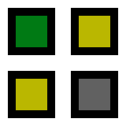

[中文](README_ZH.md) | English

<div align="center">



# Superflat

**Git-powered version control for Minecraft Java Edition saves**

[](#license)
[](https://www.rust-lang.org/)
[](https://github.com/HairlessVillager/superflat/releases)
[](https://github.com/HairlessVillager/superflat/releases)

</div>

---

Superflat is a Minecraft save format conversion tool that converts Java Edition saves into a **Git-friendly** format. By leveraging Git's mature version control and delta compression capabilities, Superflat achieves:

- 🗜️ **Extreme Space Efficiency**: Each incremental backup averages only **~2%** of the original Zip size
- ⚡ **Fast Backup**: ~30 MiB/s processing, ~20 MiB/s Git write speed
- 🔄 **Fast Rollback**: ~45 MiB/s restoration

## 🗺️ Roadmap

- [x] `superflat flatten`: Deconstruct save files into a flattened format
- [x] `superflat unflatten`: Reconstruct save files from the flattened format
- [x] Complete Rust refactor
- [x] Basic parallel computing
- [x] `superflat commit`: Stream-flatten and commit to Git
- [x] `superflat checkout`: Checkout from Git and stream-restore the save
- [ ] In-depth performance profiling and extreme optimization
    - [x] `ChunkRegionCrafter` parallelization
    - [x] `LocalGitOdb` parallelization
    - [ ] More optimization...
- [ ] `superflat merge`: Implement chunk-level and game-semantic level merging
- [x] Reduce dependency on Pumpkin for the Sections Dump feature
- [x] Write auto compile GitHub Workflows
- [ ] Expand version support
    - [x] Block and biome data version support
    - [ ] Save directory format support (26.1 and later)
- [ ] Chunk de-duplication based on Minecraft original terrain generation algorithms (storing only modifications)
- [x] Change the project license to the Rust community standard MIT/Apache 2.0 dual-license
    - [x] Replace the `pumpkin-nbt` dependency
    - [x] Re-implement the Sub-chunk Dump (Sections Dump) feature
    - [x] Remove `src/utils/palette.rs` from Git `main` branch and force-push

## 🙏 Credits

Special thanks to the [Pumpkin-MC Project](https://github.com/Pumpkin-MC) for inspiration (and support for [legacy version](https://github.com/HairlessVillager/superflat/tree/gplv3-legacy-main)).

Thanks to the [`gitoxide` project](https://github.com/GitoxideLabs/gitoxide) (licensed under MIT / Apache-2.0) for providing a highly efficient and modern Git-compatible implementation. This project relies on `gitoxide` for high-performance object reading and writing.

Thanks to Lewis for providing the 4.6 GiB real-world test save. In the early stages of development, we lacked a large amount of real experimental data.

## 📦 Download and Installation

Ensure [Git](https://git-scm.com/install/) is installed, as `sf commit` and `sf checkout` depend on Git for streaming backup and restoration.

There are two ways to get the Superflat executable:

- **Pre-built**: Download pre-compiled binaries from the [GitHub Release](https://github.com/HairlessVillager/superflat/releases) page.
- **From source**: Compile locally (see below).

### Local Compilation

Ensure you have [rustup](https://rustup.rs/) installed, then:

```sh
git clone https://github.com/HairlessVillager/superflat.git
cd superflat
cargo install --path . --bin sf
```

## 🚀 Quick Start

### Using the GUI

We provide a GUI build for Windows users. Download the `superflat-gui-x.x.x-x86_64-pc-windows-msvc.exe` executable from the [GitHub Release](https://github.com/HairlessVillager/superflat/releases) page. Simply double-click the `.exe` to run it.

> [!TIP]
> If you trust the application, whitelist the GUI process in Windows Defender (see [guide](docs/windows-defender-bypass.md)) for better performance.

See [this guide](docs/gui-guide.md) for instructions on using the GUI. The GUI aims to provide a WYSIWYG interface for basic operations (`sf commit`, `sf checkout`, and some Git commands); for advanced operations, please use the CLI.

### Using the CLI

This section demonstrates a standard workflow:

#### Step 1 — Prepare

You need to define the following two paths:

1. **Save Path (`$SAVE_DIR`)**: The specific world directory under `.minecraft/saves/` (containing `level.dat`).
2. **Git Repo Path (`$GIT_DIR`)**: A bare Git repository to store the final backup data. Recommended for reliable storage media; reserve at least 3× the space of the original save.

You also need to know the Minecraft version of your save (`$MC_VERSION`), e.g. `1.21.11`.

#### Step 2 — Initialize Git Repository

For the first backup, create a bare Git repository:

```sh
git init --initial-branch main --bare $GIT_DIR
git --git-dir $GIT_DIR config gc.auto 0              # Disable auto-GC for smaller repository size later
git --git-dir $GIT_DIR config core.logAllRefUpdates true  # Record reflog for simpler commit syntax
```

Use these commands to check your Git commit identity:

```sh
git config user.name
git config user.email
```

If nothing is displayed, set your global Git identity to prevent commit errors:

```sh
git config --global user.name $YOUR_USER_NAME
git config --global user.email $YOUR_USER_EMAIL
```

#### Step 3 — Execute Backup

```sh
sf commit $SAVE_DIR $GIT_DIR --mc-version $MC_VERSION --repack -b main --init -m "Your backup note"
```

This command reads the save at `$SAVE_DIR`, parses it as Minecraft version `$MC_VERSION`, creates an initial commit on the `main` branch of the bare repository at `$GIT_DIR`, and automatically repacks loose objects.

<details>
<summary><code>sf commit --help</code></summary>

```text
$ sf commit --help
Flatten save and commit to Git

Usage: sf commit [OPTIONS] --branch <BRANCH> --message <MESSAGE> --mc-version <MC_VERSION> <SAVE_DIR> <GIT_DIR>

Arguments:
  <SAVE_DIR>  Path to your save
  <GIT_DIR>   Path to the bare Git repository

Options:
  -b, --branch <BRANCH>          Commit to this branch
  -v, --verbose...               Increase logging verbosity
      --init                     Commit as initial commit
  -q, --quiet...                 Decrease logging verbosity
  -m, --message <MESSAGE>        Commit message
      --repack                   Automatically repack loose objects
      --mc-version <MC_VERSION>  Minecraft version (e.g. 1.21.11)
  -h, --help                     Print help
```

</details>

#### Step 4 — Restore Backup

> [!WARNING]
> If `$SAVE_DIR` is not empty, please back up its contents manually (e.g., as a `.zip`) before restoring.

```sh
sf checkout $SAVE_DIR $GIT_DIR -c "main@{10 minutes ago}"
# Restores to the latest commit on the main branch 10 minutes ago
```

## 🔬 How It Works

Superflat's design is based on two core insights:

- **Spatial Dimension**: Most of a Minecraft save's volume is concentrated in `region/*.mca` files. While there are many duplicate blocks and biomes, the `.mca` compression mechanism is limited to the interior of a single chunk.
- **Temporal Dimension**: Differences between adjacent backups are minimal. Traditional Zip backups treat each snapshot as an isolated island, wasting massive amounts of spatio-temporal redundant data.

> **In short: Minecraft saves are highly repetitive across both space and time.**

Git, as a mature version control tool, uses object ordering and **Delta Compression algorithms** that can precisely identify and eliminate this redundancy. Superflat "flattens" the complex `.mca` binary format into small files that Git can easily recognize, thereby unlocking Git's full compression potential.

## 📊 Experiments and Benchmarks

We verified the tool's effectiveness using 13 consecutive backups of a survival save (Seed: 42), referred to as the `test42` dataset. For detailed analysis, see [bench.md](docs/blog/bench.md).

### Environment

| Component | Details                                   |
| --------- | ----------------------------------------- |
| CPU       | AMD Ryzen 7 7840H (16 threads) @ 4.97 GHz |
| RAM       | 32 GiB                                    |
| OS        | Omarchy 3.4.2 (Kernel 6.19.6)             |

### Key Findings

1. **Extreme Incremental Compression**: With a `window=2` configuration, the total storage overhead for 13 versions was only 9.15 MiB more than a single Zip backup. Each incremental backup averages only **1.93%** of the original Zip size.
2. **Ultimate Archival Potential**: After running `git gc --aggressive`, the total volume of the repository containing 13 historical versions (30.7 MiB) was actually **22% smaller** than a **single** version's Zip archive (39.54 MiB).
3. **Performance Balance**:
    - Increasing the `window` parameter yields diminishing returns for compression while increasing computation time exponentially.
    - **Daily Backups**: Recommended `window <= 16`; backup time remains stable under 1 second.
    - **Long-term Archiving**: Recommended to perform `gc --aggressive` periodically.

## 📄 License

Licensed under either of

- Apache License, Version 2.0 ([LICENSE-APACHE](./LICENSE-APACHE) or http://www.apache.org/licenses/LICENSE-2.0)
- MIT license ([LICENSE-MIT](./LICENSE-MIT) or http://opensource.org/licenses/MIT)

at your option.

> [!CAUTION]
> **Note on Legacy Versions:**
>
> The [GPLv3-legacy-main](https://github.com/HairlessVillager/superflat/tree/gplv3-legacy-main) branch (which depended on the GPLv3-licensed Pumpkin project) remains licensed under the [GNU General Public License v3.0](./LICENSE). Current versions of this project no longer use GPL dependencies and are governed by the Apache/MIT dual license.
