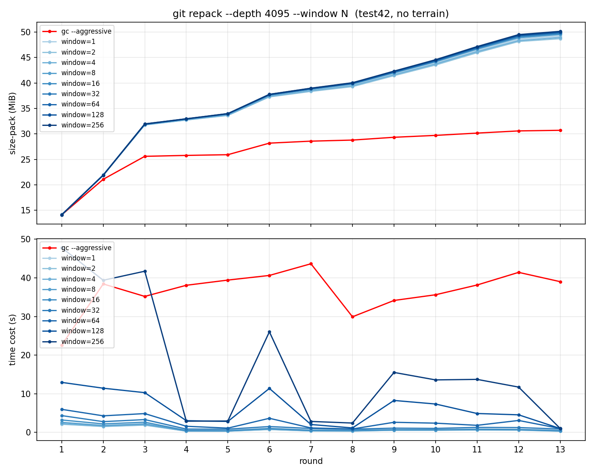

## 实验

为了验证该工具对于大多数场景的有效性，并更好地优化该工具，我们对一个 Minecraft 生存存档的 13 个备份测量了打包操作的性能开销。

实验环境如下：

- 内核：Linux 6.19.6-arch1-1
- 系统：Omarchy 3.4.2
- CPU：AMD Ryzen 7 H 255 (16) @ 4.97 GHz
- 内存：32 GiB

### 数据集

test42: 邀请一位玩家在一个普通的生存存档（种子固定为 42）生存 2 小时，期间每约 10 分钟备份一次，一共获得 13 个存档。玩家通过正常的游戏获取树木与矿石资源，在最近的村庄安营扎寨，维护一个简单的村民交易站。最终进度为获得 1 组绿宝石。

对于每个存档，其原始大小、 .zip 压缩包大小和区块数量如下：

| #   | Name                | Raw Size (MiB) | Zip Size (MiB) | Chunk Count |
| --- | ------------------- | -------------- | -------------- | ----------- |
| 1   | 2026-03-15_15-55-44 | 29.11          | 19.23          | 4391        |
| 2   | 2026-03-15_16-09-57 | 41.81          | 27.64          | 6305        |
| 3   | 2026-03-15_16-20-00 | 48.96          | 34.21          | 7165        |
| 4   | 2026-03-15_16-30-10 | 49.01          | 34.43          | 7165        |
| 5   | 2026-03-15_16-40-20 | 49.07          | 34.55          | 7165        |
| 6   | 2026-03-15_16-50-29 | 51.77          | 36.83          | 7514        |
| 7   | 2026-03-15_17-00-40 | 52.08          | 37.31          | 7528        |
| 8   | 2026-03-15_17-10-49 | 52.10          | 37.46          | 7528        |
| 9   | 2026-03-15_18-39-46 | 52.47          | 38.14          | 7565        |
| 10  | 2026-03-15_18-49-57 | 52.66          | 38.64          | 7581        |
| 11  | 2026-03-15_19-14-15 | 52.87          | 39.17          | 7599        |
| 12  | 2026-03-15_19-24-26 | 53.05          | 39.49          | 7620        |
| 13  | 2026-03-15_19-29-51 | 53.08          | 39.54          | 7620        |

数据集使用 CC BY 4.0 协议署名，请联系 hairlessvillager@foxmail.com 获取原始数据集。

### 实验指标

- 时间开销：`git repack` 命令的墙上时间。
- 空间开销：`git repack` 命令执行后 `git count-object -vH` 展示的 `size-pack` 大小。

### 实验步骤

通过 `scripts/bench.py flatten` 平坦化 13 个存档，然后通过 `scripts/bench.py commit_repack` 计算在从 1 到 256 不同 `window` 参数下 `git repack` 命令和 `git gc --aggressive` 命令的时间与空间开销。

### 实验结果

原始实验结果：[bench/bench-results.csv](bench/bench-results.csv)

_图 1：在不同 `window` 参数下 `git repack` 的性能表现。上图：随着备份次数的增多，Git Pack 文件大小逐渐增大，且不同 `window` 参数对 Pack 文件大小影响有限，在 `window=2` 时 Pack 文件大小略微小于其他 `window` 参数；下图：对于每个 `window` 参数，`git repack` 时间都是在第一次备份时最多，且 `window` 参数越大时间开销也越大，对于 `window<=16`，除了第 1~3 次 `git repack` 用时 2 秒，其余时间开销都在 1 秒以内。_

### 实验结论

通过对 `test42` 数据集的测试，我们可以得出以下结论：

1. `git repack` 增量存储极小：这意味着 Superflat 配合 Git 存储了 13 个历史版本的总空间（#13, window=2, 48.69 MiB），比 .zip 存储 1 个版本的空间（#13, 39.54 MiB）多了 9.15 MiB 空间，均摊到 12 个历史版本里，每个版本仅占 .zip 文件的 1.93%。这证明了 Minecraft 存档平坦化后，不同版本之间存在高度的数据冗余，Git 的 Delta 压缩算法能极好地提取这些重复项。
2. `git gc --aggressive` 超越 Zip 压缩：经过 13 轮备份后，使用 `git gc --aggressive` 得到的最终 Pack 文件大小(#13, window=0, 30.7 MiB) 为 .zip 文件（#13, 39.54 MiB）的 77.64%，减少了约四分之一的空间。
3. `window` 参数的性能权衡：
    - 空间增益边际递减：如图 1（上）所示，增大 `window` 参数（从 1 到 256）对缩减 Pack 文件大小的效果非常有限。在常规 `git repack` 下，各参数最终生成的 Pack 大小均在 48-50 MiB 左右波动。
    - 时间开销呈指数增长：如图 1（下）所示，随着 `window` 的增大，计算开销显著增加。尤其是 `window=256` 时，在某些轮次的时间开销超过了 25 秒，而 `window <= 16` 时通常能在 1-2 秒内完成。
    - `gc --aggressive` 的特殊性：虽然 `gc --aggressive` 耗时最久（稳定在 30-45 秒之间），但它能带来质的压缩飞跃（从 ~49 MiB 降至 ~30 MiB），这是因为它使用了更深的 `depth` 和更彻底的重打包策略。
4. 备份操作的平稳性：
    - 实验前 3 轮由于涉及初始地图生成和大量新区块的产生，时间开销波动较大。
    - 从第 4 轮开始，随着玩家活动范围趋于稳定（区块数量增长放缓），在低 `window` 设置下，增量备份的时间成本基本稳定在 1 秒以内。这验证了 Superflat 作为高频备份工具的可行性。

### 总结建议

- 日常备份：建议使用默认的 Git 配置或较小的 `window` 参数（小于 16 的值），可以在 1 秒内完成秒级备份，并获得远优于单纯文件拷贝的存储效率。
- 长期归档：在需要长期存档或清理空间时，可每隔一段时间运行一次 `git gc --aggressive`。虽然耗时较长，但能将存储空间进一步压缩，实现极低成本的长久保存。
