# GUI Guide

  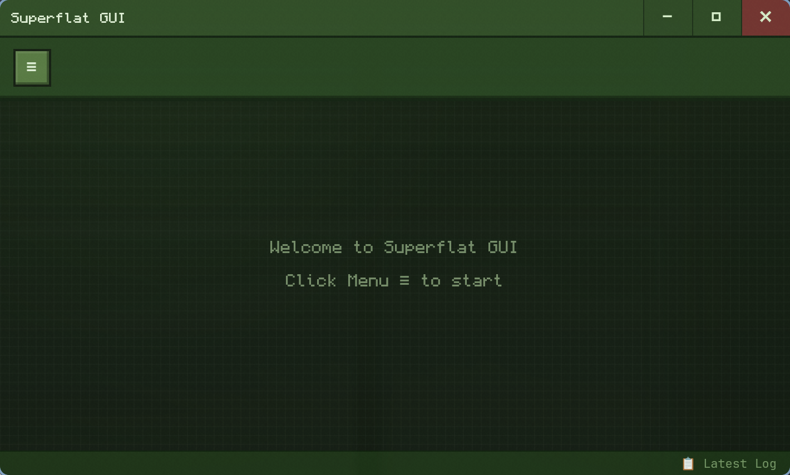

The GUI is designed around several workflows:

- [Local Backup and Restore](#local-backup-and-restore)
- [Syncing a Local Save to a Remote Repository](#syncing-a-local-save-to-a-remote-repository)

## Local Backup and Restore

Click the `☰` button in the top-left to open the profile menu.

  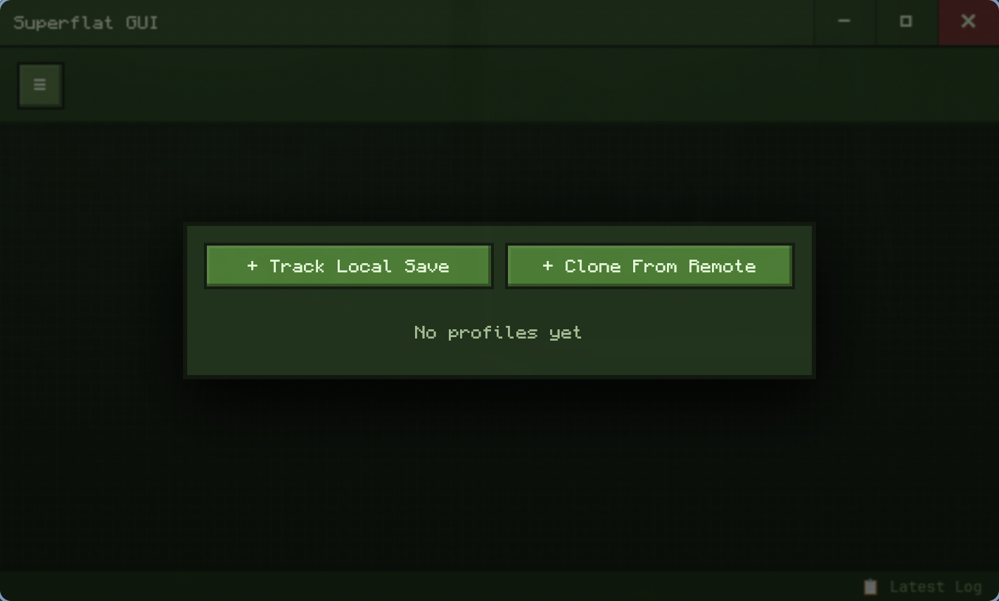

Click `Track Local Save` on the left to track a local save:

  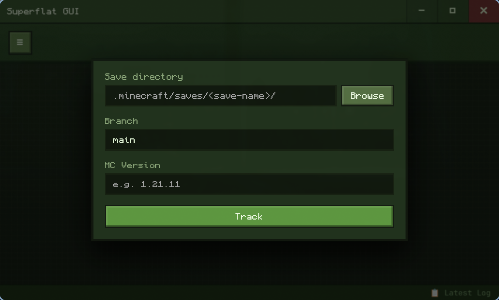

Fill in the required fields:

- `Save directory`: the save folder containing `level.dat`
- `Branch`: Git branch name, defaults to `main` (recommended)
- `MC Version`: Minecraft Java Edition version, e.g. `1.18`, `1.21.11`, `26.1`

  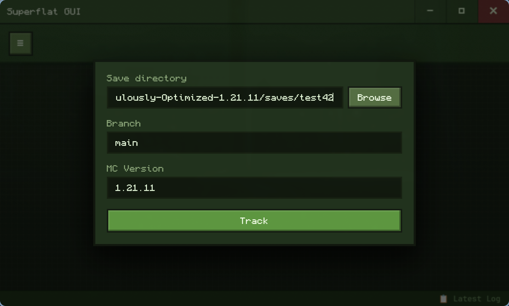

Click `Track` to save the profile:

  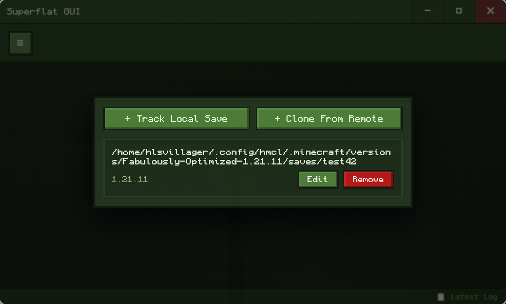

Select the profile:

  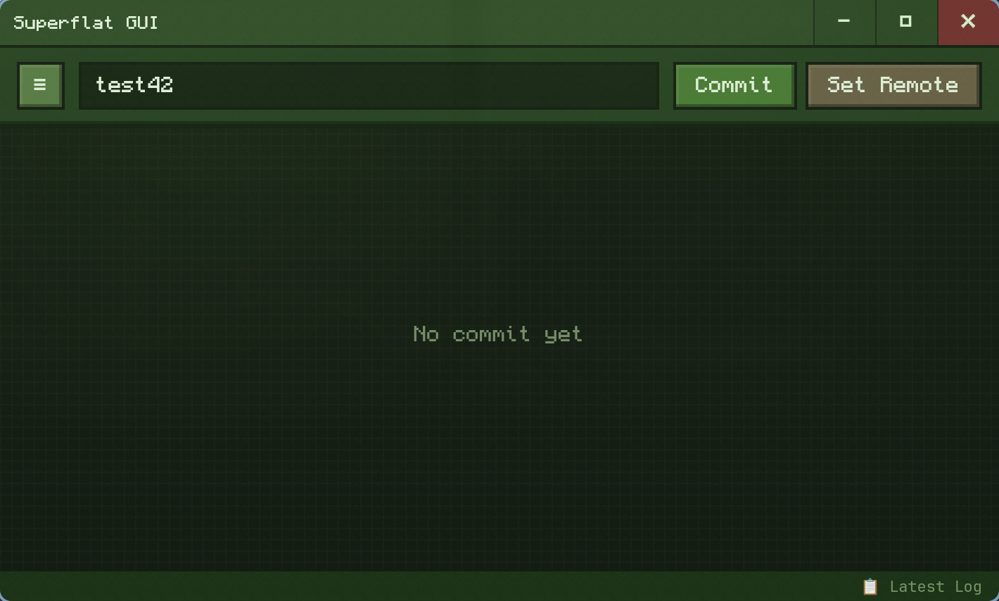

Click the `Commit` button and fill in the required information:

  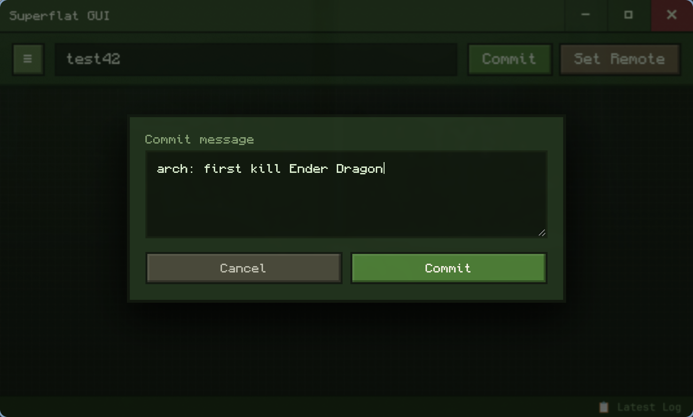

The commit type refers to the kind of change made in Minecraft. Some suggestions:

- **arch**: Achievement/advancement
- **build**: Building / decoration
- **farm**: Redstone machine / automation
- **explore**: Exploration / coordinate discovery / dimension travel
- **daily**: Maintenance / resource gathering / storage organization
- **system**: Mod / version / game rule changes

After committing you can see the commit history:

  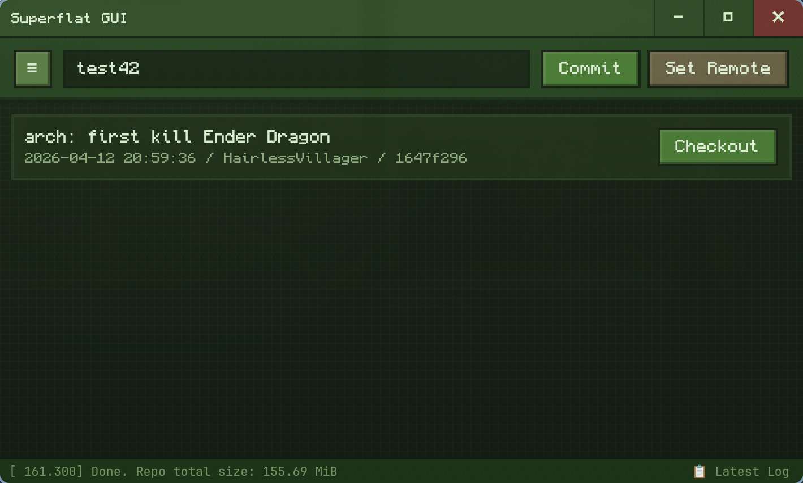

Click the `Checkout` button to restore a commit (the current save will be moved to `.minecraft/saves/<save-name>.bak`):

  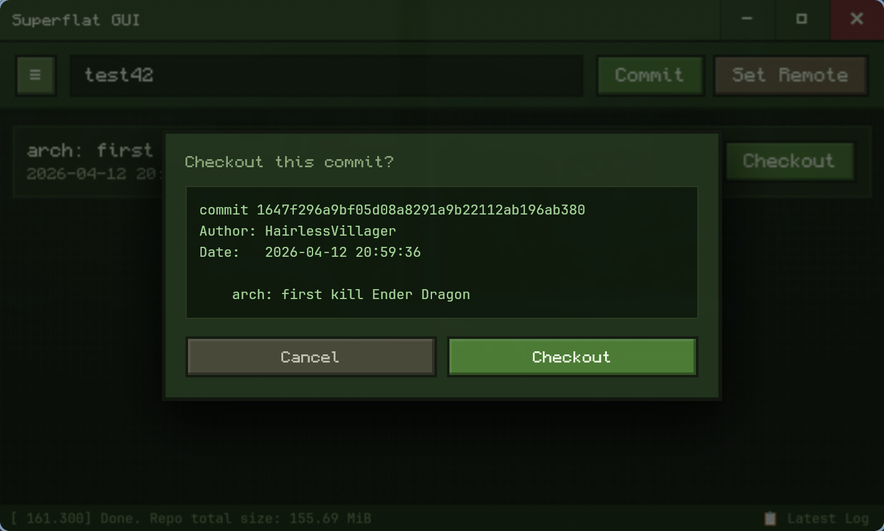

## Syncing a Local Save to a Remote Repository

Open a profile, click the `Set Remote` button, and enter your remote repository URL in the `Remote URL` field (SSH is recommended):

  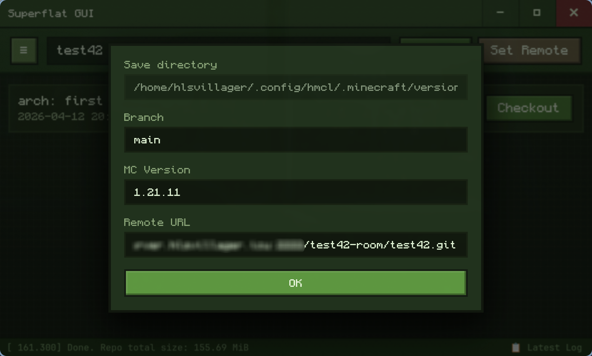

After clicking OK, you will see `Pull` (fetch remote to local) and `Push` (push local to remote) buttons.

  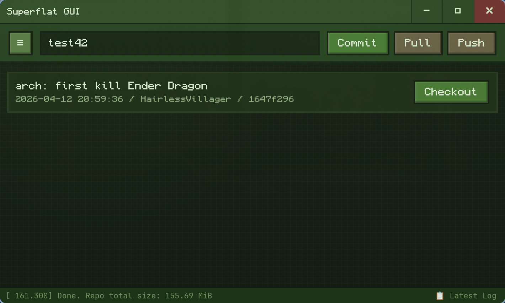

If you just created a new commit, click `Push` to push it to the remote repository. Conversely, if you want to retrieve the latest save from the remote, click `Pull`, then click `Checkout` on the corresponding commit to restore the save.
