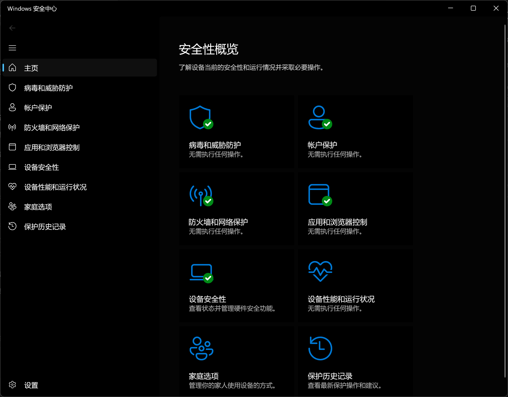
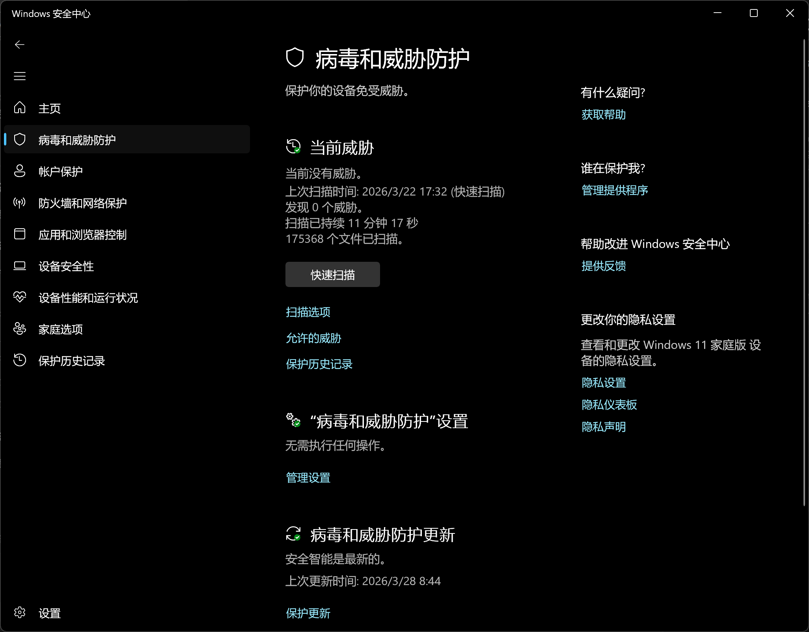
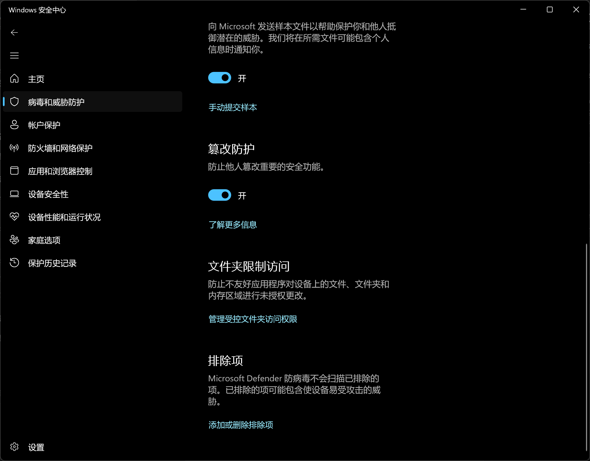
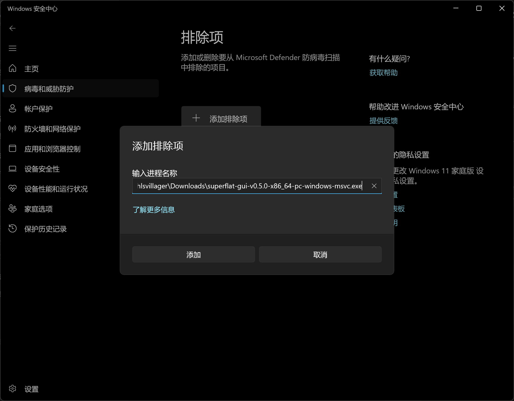

# 将 Superflat GUI 加入 Windows Defender 白名单

如果你信任从本项目 Release 页面下载的 GUI 可执行文件，可以把它加入 Microsoft Defender 的排除项，减少实时扫描带来的额外开销。

这不是必须步骤，只是性能优化。只有在你确认该可执行文件来源可信时才建议这样做。

## 为什么要这样做

Superflat 在备份和恢复时会频繁读取、写入大量小文件。Windows Defender 的实时扫描可能会重复检查这些文件访问，导致：

- GUI 中的备份或恢复速度变慢
- 控制台输出已经开始，但磁盘占用持续偏高
- 首次运行或大存档操作时卡顿更明显

将 GUI 进程加入排除项后，Defender 不会再对这个进程触发的相关文件操作进行同样强度的扫描，通常能改善性能。

## 操作步骤

以下截图来自 Windows 11 中文界面。Windows 10 的名称可能略有差异，但路径基本一致。

### 1. 打开 Windows 安全中心

打开 `Windows 安全中心`，进入主页：

### 2. 进入“病毒和威胁防护”

在左侧点击 `病毒和威胁防护`：

然后向下滚动，找到 `“病毒和威胁防护”设置`，点击其中的 `管理设置`。

### 3. 打开排除项设置

继续向下滚动到 `排除项` 一节，点击 `添加或删除排除项`：

### 4. 添加 GUI 进程

在排除项页面点击 `添加排除项`，选择 `进程`，然后输入 `superflat-gui` 的可执行文件名或完整路径。

例如，若你直接运行 Release 下载的文件，可以输入类似下面的路径：

`C:\Users\<你的用户名>\Downloads\superflat-gui-v0.5.0-x86_64-pc-windows-msvc.exe`

界面示例如下：

输入完成后点击 `添加` 即可。
